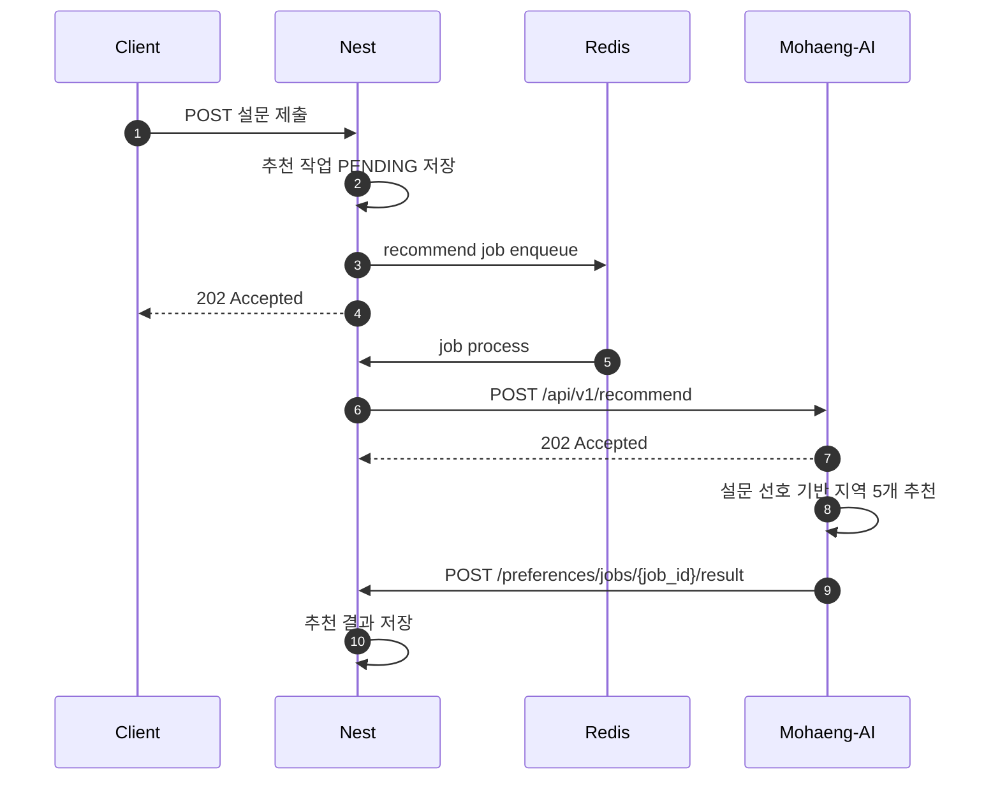

# 요약

여행지 추천 기능은 NestJS가 사용자 설문 기반 추천 작업을 큐에 등록하고, Mohaeng-AI가 추천 지역 5개를 생성한 뒤 콜백으로 결과를 반환하는 비동기 구조입니다.
Mohaeng-AI는 `POST /api/v1/recommend` 요청을 즉시 수락하고, 실제 추천 결과는 `{callback_url}/preferences/jobs/{job_id}/result`로 전송합니다.

# 배경

추천 작업은 LLM 호출을 포함하므로 클라이언트 요청 흐름에서 동기 처리하지 않습니다.
NestJS는 클라이언트 요청과 DB 상태를 관리하고, Mohaeng-AI는 설문 선호를 분석해 추천 결과만 반환하는 워커 역할을 수행합니다.

# 본문

## 역할

| 구성요소 | 역할 |
| --- | --- |
| Client | 설문 응답 제출 및 추천 결과 조회 |
| NestJS | 설문 저장, 추천 작업 생성, BullMQ enqueue, Python 트리거, 콜백 수신 |
| Redis / BullMQ | 추천 작업 큐와 상태 관리 |
| Mohaeng-AI | 설문 선호 기반 추천 지역 5개 생성 |

## 시퀀스



## NestJS에서 Mohaeng-AI로 보내는 요청

| 항목 | 내용 |
| --- | --- |
| Endpoint | `POST /api/v1/recommend` |
| 인증 | `x-service-secret` |
| 응답 | `202 ACCEPTED` |

```json
{
  "job_id": "recommend-job-12345",
  "callback_url": "https://api.example.com",
  "weather": "OCEAN_BEACH",
  "travel_range": "MEDIUM_HAUL",
  "travel_style": "MODERN_TRENDY",
  "budget_level": "BALANCED",
  "food_personality": ["LOCAL_HIDDEN_GEM"],
  "main_interests": ["SHOPPING_TOUR", "DYNAMIC_ACTIVITY"]
}
```

즉시 응답:

```json
{
  "job_id": "recommend-job-12345",
  "status": "ACCEPTED"
}
```

## Mohaeng-AI에서 NestJS로 보내는 콜백

| 항목 | 내용 |
| --- | --- |
| 기본 경로 | `{callback_url}/preferences/jobs/{job_id}/result` |
| 인증 | `x-service-secret` |
| 성공 상태 | `SUCCESS` |
| 실패 상태 | `FAILED` |

성공 콜백:

```json
{
  "status": "SUCCESS",
  "data": {
    "recommended_destinations": [
      { "region_name": "MALDIVES" },
      { "region_name": "HAWAII" },
      { "region_name": "ZANZIBAR" },
      { "region_name": "CANCUN" },
      { "region_name": "BALI" }
    ]
  }
}
```

실패 콜백:

```json
{
  "status": "FAILED",
  "error": {
    "code": "LLM_TIMEOUT",
    "message": "Analysis took too long to complete."
  }
}
```

## 정책

- 추천 결과는 정확히 5개의 `region_name`을 포함합니다.
- 각 `region_name`은 Mohaeng-AI의 `Region` Enum 값이어야 합니다.
- 추천 처리 기본 타임아웃은 `RECOMMEND_TIMEOUT_SECONDS`이며 기본값은 45초입니다.
- 콜백 전송 기본 타임아웃은 `CALLBACK_TIMEOUT_SECONDS`이며 기본값은 10초입니다.
- 콜백 전송은 timeout, connection error, HTTP 429, HTTP 5xx에 대해 재시도합니다.

# 관련 문서

- [설문 기반 여행지 추천 기능](../specs/recommend-destinations.md)
- [여행지 추천 API](../api/recommend-api.md)
- [시장 문제와 타겟 사용자](../context/market-and-target-users.md)

# TODO

- NestJS의 클라이언트-facing 설문 endpoint와 상태 조회 endpoint가 확정되면 연결 문서를 보강합니다.
