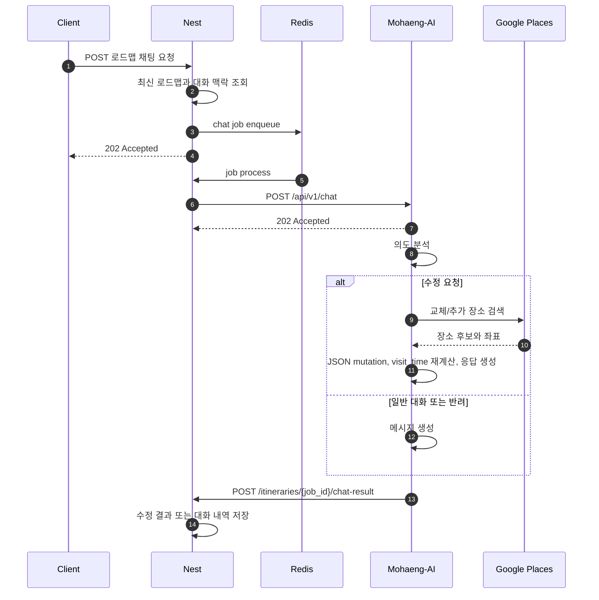

# 요약

로드맵 채팅 수정 기능은 NestJS가 최신 로드맵과 사용자 발화를 Mohaeng-AI에 전달하고, Mohaeng-AI가 의도 분석과 수정 파이프라인을 실행한 뒤 콜백으로 결과를 반환하는 비동기 구조입니다.
Mohaeng-AI는 `POST /api/v1/chat` 요청을 즉시 수락하고, 수정 결과는 `{callback_url}/itineraries/{job_id}/chat-result`로 전송합니다.

# 배경

로드맵 수정은 현재 일정 JSON, 사용자 선호, 최근 대화 맥락을 함께 사용해야 합니다.
NestJS는 최신 로드맵과 대화 이력을 조회해 Python에 전달하고, Mohaeng-AI는 의도 분석, Google Places 검색, JSON mutation, 방문 시간 재계산, 사용자 메시지 생성을 담당합니다.

# 본문

## 역할

| 구성요소 | 역할 |
| --- | --- |
| Client | 채팅 요청 입력 및 결과 조회 |
| NestJS | 최신 로드맵 조회, 대화 이력 조회, BullMQ enqueue, Python 트리거, 콜백 수신 |
| Redis / BullMQ | 채팅 수정 작업 큐와 상태 관리 |
| Mohaeng-AI | 의도 분석, 장소 검색, 로드맵 수정, 응답 메시지 생성 |
| Google Places API | 교체/추가 장소 검색과 좌표 제공 |

## 시퀀스



## NestJS에서 Mohaeng-AI로 보내는 요청

| 항목 | 내용 |
| --- | --- |
| Endpoint | `POST /api/v1/chat` |
| 인증 | `x-service-secret` |
| 응답 | `202 ACCEPTED` |

```json
{
  "job_id": "modify-job-12345",
  "callback_url": "https://api.example.com",
  "current_itinerary": {
    "start_date": "2026-02-11",
    "end_date": "2026-02-11",
    "trip_days": 1,
    "nights": 0,
    "people_count": 2,
    "tags": ["도심", "전시"],
    "title": "서울 당일치기 문화 코스",
    "summary": "도심 전시와 식사를 균형 있게 즐기는 일정입니다.",
    "planning_preference": "PLANNED",
    "itinerary": [
      {
        "day_number": 1,
        "daily_date": "2026-02-11",
        "places": [
          {
            "place_name": "블루보틀 삼청",
            "place_id": "place_id_1",
            "address": "서울 종로구 삼청로 76",
            "latitude": 37.5829,
            "longitude": 126.9812,
            "place_url": "https://maps.google.com/?q=bluebottle",
            "description": "아침 커피로 가볍게 시작하기 좋은 카페입니다.",
            "visit_sequence": 1,
            "visit_time": "09:00"
          }
        ]
      }
    ]
  },
  "companion_type": ["FAMILY"],
  "travel_themes": ["UNIQUE_TRIP"],
  "pace_preference": "DENSE",
  "planning_preference": "PLANNED",
  "destination_preference": "TOURIST_SPOTS",
  "activity_preference": "ACTIVE",
  "priority_preference": "EFFICIENCY",
  "user_query": "1일차 1번째 장소를 미술관으로 바꿔줘",
  "session_history": [
    {
      "role": "user",
      "content": "서울 당일치기 일정 만들어줘"
    }
  ]
}
```

즉시 응답:

```json
{
  "job_id": "modify-job-12345",
  "status": "ACCEPTED"
}
```

## Mohaeng-AI에서 NestJS로 보내는 콜백

| 항목 | 내용 |
| --- | --- |
| 기본 경로 | `{callback_url}/itineraries/{job_id}/chat-result` |
| 인증 | `x-service-secret` |
| 성공 상태 | `SUCCESS` |
| 그 외 상태 | `GENERAL_CHAT`, `ASK_CLARIFICATION`, `REJECTED`, `FAILED` |

성공 콜백:

```json
{
  "status": "SUCCESS",
  "message": "요청하신 대로 1일차 1번째 장소를 변경했습니다.",
  "diff_keys": ["day1_place1"],
  "modified_itinerary": {
    "start_date": "2026-02-11",
    "end_date": "2026-02-11",
    "trip_days": 1,
    "nights": 0,
    "people_count": 2,
    "tags": ["도심", "전시"],
    "title": "서울 당일치기 문화 코스",
    "summary": "도심 전시와 식사를 균형 있게 즐기는 일정입니다.",
    "itinerary": []
  }
}
```

일반 대화, 추가 확인, 반려 콜백:

```json
{
  "status": "ASK_CLARIFICATION",
  "message": "삭제할 일차와 장소 순서를 함께 알려주세요. 예: '1일차 2번째 장소 삭제해줘'",
  "diff_keys": [],
  "modified_itinerary": null
}
```

실패 콜백:

```json
{
  "status": "FAILED",
  "error": {
    "code": "LLM_TIMEOUT",
    "message": "LLM 응답 시간이 초과되었습니다."
  }
}
```

## 정책

- 채팅 수정 작업은 `LLM_TIMEOUT_SECONDS` 안에 완료되어야 하며 기본값은 180초입니다.
- `SUCCESS` 상태일 때만 `modified_itinerary`를 포함합니다.
- `GENERAL_CHAT`, `ASK_CLARIFICATION`, `REJECTED` 상태에서는 `modified_itinerary`가 `null`입니다.
- `diff_keys`는 프론트엔드가 변경된 장소 카드를 강조하기 위한 식별자입니다.
- 교체/추가 장소는 Google Places 검색 결과를 사용합니다.
- 교체/추가 장소의 Google Places `primaryType`과 `types`는 내부 정적 매핑으로 `place_category`를 산출하는 데만 사용합니다.
- Google Places 원본 `primary_type`과 식사 anchor 판단값 같은 내부 힌트는 콜백에 포함하지 않습니다.
- 하루 장소 수는 최소 1개, 최대 10개를 기준으로 합니다.
- 콜백 전송 기본 타임아웃은 `CALLBACK_TIMEOUT_SECONDS`이며 기본값은 10초입니다.
- 콜백 전송은 timeout, connection error, HTTP 429, HTTP 5xx에 대해 재시도합니다.

# 관련 문서

- [로드맵 채팅 수정 기능](../specs/roadmap-chat-modification.md)
- [로드맵 채팅 API](../api/chat-api.md)
- [모행 프로젝트 개요](../context/project-overview.md)

# TODO

- NestJS의 채팅 상태 조회와 대화 이력 저장 정책이 확정되면 Client -> NestJS 구간을 보강합니다.
