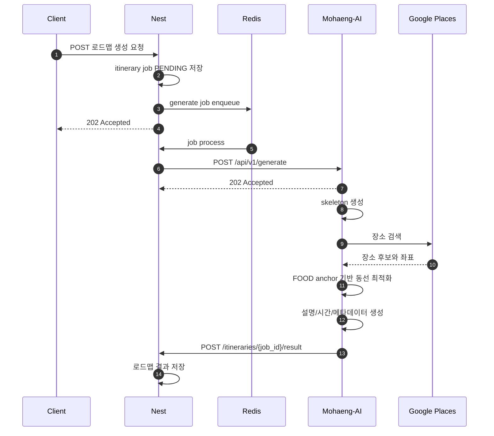

# 요약

로드맵 생성 기능은 NestJS가 생성 작업을 큐에 등록하고, Mohaeng-AI가 LangGraph 기반 로드맵 생성 파이프라인을 실행한 뒤 콜백으로 결과를 반환하는 비동기 구조입니다.
Mohaeng-AI는 `POST /api/v1/generate` 요청을 즉시 수락하고, 생성 결과는 `{callback_url}/itineraries/{job_id}/result`로 전송합니다.

# 배경

로드맵 생성은 LLM 추론, Google Places 검색, 장소 설명과 메타데이터 생성이 포함된 장기 작업입니다.
NestJS는 작업 상태와 저장을 담당하고, Mohaeng-AI는 무상태 워커처럼 생성 요청을 처리한 뒤 결과를 callback으로 전달합니다.

# 본문

## 역할

| 구성요소 | 역할 |
| --- | --- |
| Client | 로드맵 생성 요청 및 결과 조회 |
| NestJS | 요청 저장, BullMQ enqueue, Python 트리거, 콜백 수신, 결과 저장 |
| Redis / BullMQ | 생성 작업 큐와 상태 관리 |
| Mohaeng-AI | 로드맵 생성 파이프라인 실행 |
| Google Places API | 실제 장소 검색, 주소, 좌표, 지도 URL 제공 |

## 시퀀스



## NestJS에서 Mohaeng-AI로 보내는 요청

| 항목 | 내용 |
| --- | --- |
| Endpoint | `POST /api/v1/generate` |
| 인증 | `x-service-secret` |
| 응답 | `202 ACCEPTED` |

```json
{
  "job_id": "generate-job-12345",
  "callback_url": "https://api.example.com",
  "payload": {
    "start_date": "2026-02-07",
    "end_date": "2026-02-09",
    "regions": [
      {
        "region": "SEOUL",
        "start_date": "2026-02-07",
        "end_date": "2026-02-09"
      }
    ],
    "people_count": 2,
    "companion_type": ["FAMILY"],
    "travel_themes": ["UNIQUE_TRIP"],
    "pace_preference": "DENSE",
    "planning_preference": "PLANNED",
    "destination_preference": "TOURIST_SPOTS",
    "activity_preference": "ACTIVE",
    "priority_preference": "EFFICIENCY",
    "notes": "전시와 맛집 위주로 추천해 주세요."
  }
}
```

즉시 응답:

```json
{
  "job_id": "generate-job-12345",
  "status": "ACCEPTED"
}
```

## Mohaeng-AI에서 NestJS로 보내는 콜백

| 항목 | 내용 |
| --- | --- |
| 기본 경로 | `{callback_url}/itineraries/{job_id}/result` |
| 인증 | `x-service-secret` |
| 성공 상태 | `SUCCESS` |
| 실패 상태 | `FAILED` |

성공 콜백:

```json
{
  "status": "SUCCESS",
  "data": {
    "start_date": "2026-02-07",
    "end_date": "2026-02-09",
    "trip_days": 3,
    "nights": 2,
    "people_count": 2,
    "tags": ["서울", "전시", "맛집"],
    "title": "서울 감성 여행",
    "summary": "전시와 미식을 중심으로 구성한 서울 일정입니다.",
    "itinerary": [
      {
        "day_number": 1,
        "daily_date": "2026-02-07",
        "places": [
          {
            "place_name": "국립현대미술관 서울",
            "place_id": "google-place-id",
            "address": "서울 종로구 삼청로 30",
            "latitude": 37.5787,
            "longitude": 126.9809,
            "place_url": "https://maps.google.com/?q=place_id:google-place-id",
            "place_category": "CULTURE",
            "description": "도심에서 전시를 즐길 수 있는 공간입니다.",
            "visit_sequence": 1,
            "visit_time": "09:00"
          }
        ]
      }
    ],
    "llm_commentary": "사용자의 전시와 미식 선호를 반영해 이동 부담이 적은 순서로 구성했습니다.",
    "next_action_suggestion": [
      "이 로드맵을 일정 밀도만 조정해서 다시 만들어줘."
    ]
  }
}
```

실패 콜백:

```json
{
  "status": "FAILED",
  "error": {
    "code": "LLM_TIMEOUT",
    "message": "LLM 생성 시간이 초과되었습니다."
  }
}
```

## 정책

- 전체 생성 작업은 `LLM_TIMEOUT_SECONDS` 안에 완료되어야 하며 기본값은 180초입니다.
- Google Places 요청 기본 타임아웃은 `GOOGLE_PLACES_TIMEOUT_SECONDS`이며 기본값은 10초입니다.
- 생성 결과의 장소 좌표는 LLM 생성값이 아니라 Google Places 응답값을 사용합니다.
- 생성 결과의 `place_category`는 Google Places `primaryType`과 `types`를 정적 매핑한 Mohaeng 대분류 코드입니다.
- 생성 결과의 하루별 장소 순서는 `place_category == FOOD` 장소를 hard anchor로 고정하고, anchor 사이의 비음식 장소만 Haversine 직선거리 기반으로 재정렬한 결과입니다.
- 동선 최적화는 Mohaeng-AI 내부 결정론적 알고리즘으로 수행하며, Google Routes API나 Distance Matrix API를 호출하지 않습니다.
- 최종 `visit_sequence`와 `visit_time`은 동선 최적화 후 다시 계산합니다.
- `visit_time`은 좌표 기반 이동시간을 계산하지 않고, 최종 `visit_sequence`와 장소 수를 기준으로 공용 fallback 분배 정책을 사용합니다.
- `planning_preference`가 `PLANNED`이면 `08:00` 이상 `24:00` 이하의 `HH:MM` 값을 사용합니다.
- `planning_preference`가 `SPONTANEOUS`이면 같은 fallback 분배 결과를 section label 형식으로 변환합니다.
- Google Places 원본 `primary_type`과 식사 anchor 판단값 같은 내부 힌트는 콜백에 포함하지 않습니다.
- 콜백 전송 기본 타임아웃은 `CALLBACK_TIMEOUT_SECONDS`이며 기본값은 10초입니다.
- 콜백 전송은 timeout, connection error, HTTP 429, HTTP 5xx에 대해 재시도합니다.

# 관련 문서

- [로드맵 생성 기능](../specs/roadmap-generation.md)
- [로드맵 생성 API](../api/generate-api.md)
- [여행 일정 생성을 위한 AI 파이프라인 및 데이터 소스 선정](../decisions/roadmap-generation-ai-pipeline.md)

# TODO

- NestJS의 상태 조회 API와 최종 로드맵 조회 API가 확정되면 Client -> NestJS 구간을 보강합니다.
