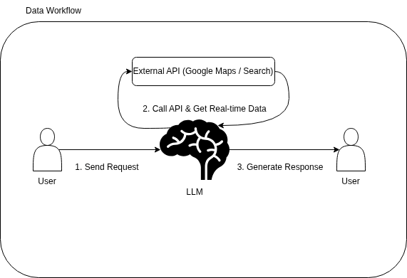
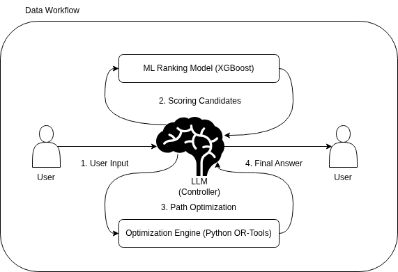
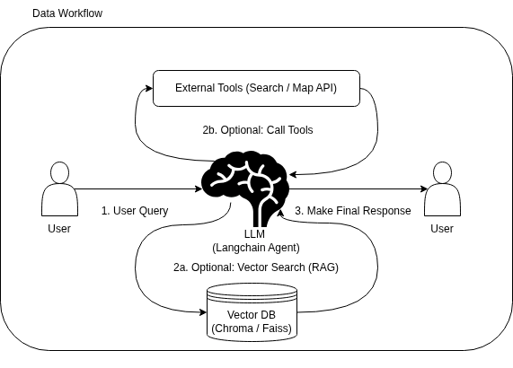
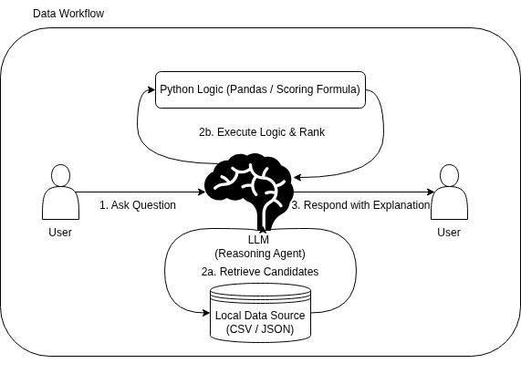
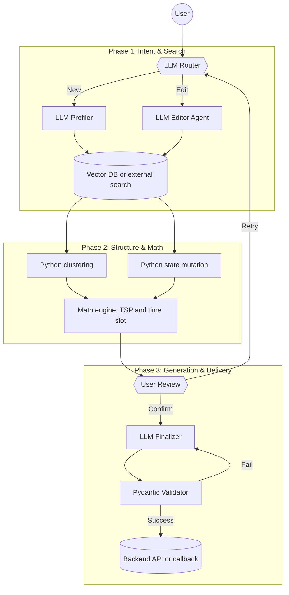

# 요약

이 문서는 여행 로드맵 생성 기능 구현을 위해 검토한 AI 파이프라인 대안을 정리합니다.
원본 Notion export의 하위 페이지와 다이어그램을 보존하되, 현재 문서 체계에 맞춰 각 대안의 정의, 구현 범위, 장단점, 적합성을 정리했습니다.
최종 결정은 [여행 일정 생성을 위한 AI 파이프라인 및 데이터 소스 선정](roadmap-generation-ai-pipeline.md)에 기록합니다.

# 배경

로드맵 생성 기능은 LLM, 외부 장소 API, 구조화 출력, 상태 관리, 수정 가능성을 함께 고려해야 합니다.
초기 검토 단계에서는 빠른 API wrapper 방식부터 LangGraph 기반 완전형 에이전트 방식까지 여러 수준의 구현안을 비교했습니다.

# 본문

## A안: API 기반 LLM 어시스턴트

> [!NOTE]
> DB 없이 외부 API와 프롬프트 제어만으로 빠르게 완성하는 라이트 구현안입니다.

주요 특징은 다음과 같습니다.

- 외부 API와 프롬프트 엔지니어링만으로 빠르게 구현합니다.
- Google Maps API 또는 네이버 지역 검색 API를 사용합니다.
- 사용자 문장에서 지역명과 테마를 추출해 API 검색어에 넣습니다.
- 가벼운 LLM 모델로 검색된 장소 목록을 시간 순서대로 나열합니다.

장점은 구현 속도가 빠르고 서버 데이터 구축 부담이 작다는 점입니다.
단점은 경로 검증과 부분 수정이 어렵고, 서비스가 단순 API wrapper처럼 보일 수 있다는 점입니다.

## B안: 머신러닝 랭킹 + 알고리즘

> [!NOTE]
> 직접 구축한 장소 데이터와 ML 랭킹, 경로 최적화 알고리즘을 결합하는 구현안입니다.

주요 특징은 다음과 같습니다.

- CSV 또는 DB로 장소 데이터 100~200개를 직접 구축합니다.
- 더미 사용자 로그를 생성해 Learning-to-Rank 모델 학습을 시도합니다.
- XGBoost 등으로 선호도 점수를 계산합니다.
- OR-Tools로 TSP 기반 최단 경로를 계산합니다.
- MMR 또는 cosine similarity로 추천 다양성을 조정할 수 있습니다.

장점은 데이터 생성, 학습, 서비스 적용의 전체 사이클을 경험할 수 있다는 점입니다.
단점은 장소 데이터와 학습 데이터 구축 비용이 크고, 실제 서비스 데이터가 부족하면 품질을 보장하기 어렵다는 점입니다.

## C안: LangChain 기반 LLM Native Agent

> [!NOTE]
> RAG와 Agent 기능을 활용해 LLM 중심으로 검색과 계획을 수행하는 구현안입니다.

주요 특징은 다음과 같습니다.

- 블로그 리뷰나 장소 설명을 텍스트로 저장하고 ChromaDB 같은 로컬 벡터 DB에 적재합니다.
- 사용자 요청과 유사한 문서를 similarity search로 찾습니다.
- LangChain Agent가 지도 API 도구를 호출해 필요한 정보를 가져오도록 구성합니다.
- 최신 LLM/RAG 기술을 쉽게 보여줄 수 있습니다.

장점은 최신 기술 스택을 활용하고 코드량을 줄일 수 있다는 점입니다.
단점은 응답 속도와 API 비용 문제가 있고, 도구 호출 실패 시 결과 안정성이 떨어질 수 있다는 점입니다.

## D안: 알고리즘 엔진 + LLM 에이전트

> [!NOTE]
> LLM의 언어 이해 능력과 코드 기반 계산의 정확성을 결합하는 하이브리드 구현안입니다.

주요 특징은 다음과 같습니다.

- LLM이 사용자의 자연어 요청을 검색 조건 JSON으로 변환합니다.
- Python 검색 함수가 장소 후보를 가져옵니다.
- 랭킹은 리뷰 수, 평점, 거리 등 명시적인 계산식으로 처리합니다.
- OR-Tools 등으로 경로 최적화를 수행합니다.
- 최종 설명은 LLM이 생성합니다.

장점은 거리 계산과 순서 정렬을 코드가 담당해 환각을 줄일 수 있다는 점입니다.
단점은 LLM과 알고리즘 엔진 사이의 인터페이스와 예외 처리가 복잡해진다는 점입니다.

## E안: 에이전트 오케스트레이션

> [!IMPORTANT]
> 상태 관리와 부분 수정 가능성을 확보하기 위해 최종 채택한 방향입니다.

주요 특징은 다음과 같습니다.

- LangGraph로 `[검색] -> [계산] -> [검증] -> [수정]` 흐름을 그래프로 제어합니다.
- 생성 결과를 텍스트가 아니라 JSON State로 유지합니다.
- 사용자의 수정 요청이 들어오면 특정 블록만 교체하고 관련 일정만 재계산합니다.
- Pydantic으로 LLM 출력을 구조화하고 검증합니다.
- 최종 결과는 백엔드 저장 API 또는 callback으로 전달합니다.

장점은 실제 서비스에 가까운 상태 관리와 부분 수정 가능성을 확보할 수 있다는 점입니다.
단점은 LangGraph 상태 관리, 장소 검색, 시간 정책, 수정 연산을 함께 다뤄야 하므로 구현 난이도가 높다는 점입니다.

# TODO

- E안의 세부 구성요소 중 현재 구현되지 않은 TSP, 클러스터링, Vector DB 도입 여부는 후속 ADR에서 별도로 판단합니다.
